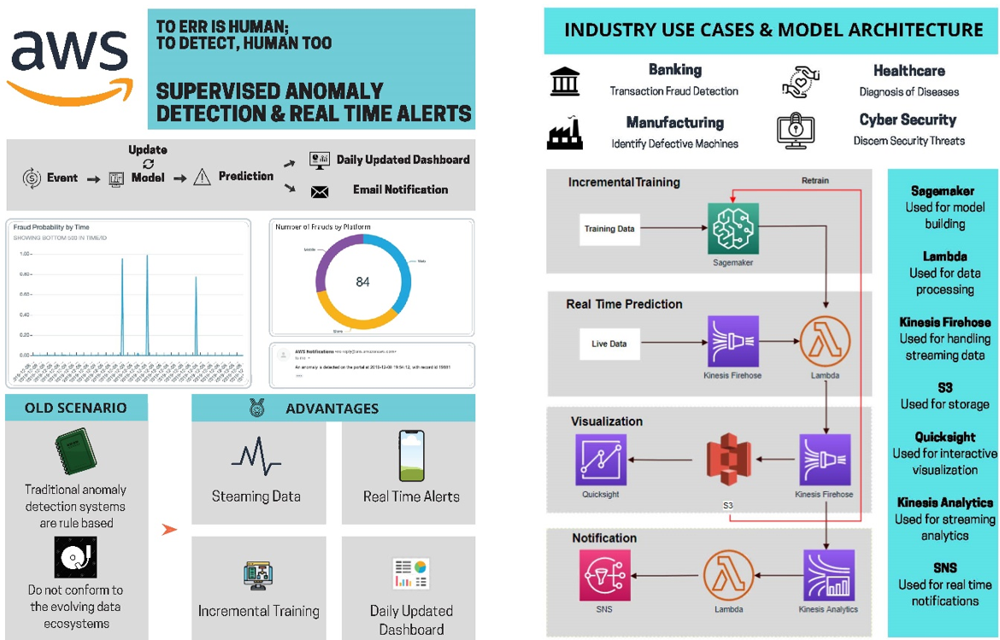

# Project Portfolio

## Data Science

### Real Time Fraud Dectection using AWS
*AWS S3, SageMaker, Kinesis, QuickSight, SNS*

Anomaly detection is a technique used to identify rare items, events, or observations which raise suspicion by differing significantly from most of the data you are analyzing. There are a wide range of applications in different industries including abnormal purchases in retail, cyber intrusions in banking, fraudulent claims in insurance, unusual machine behavior in manufacturing, and even detecting strange patterns in network traffic that could signal an intrusion. Leveraging a solution provided by [aws](https://s3.amazonaws.com/solutions-reference/fraud-detection-using-machine-learning/latest/fraud-detection-using-machine-learning.pdf), I developed an end-to-end anomaly detection workflow starting from data streaming to dashboarding. 

---

### Soccer Analytics using Association Rules
*Association Rules, Exploratory Data Analysis*

This analysis helps the Liverpool to perform better and find patterns that tangibly contribute the clubs success using historical data. I tried to explore the win probability from the betting odd and avoid losing in high probability win matches. Further, I understood what factor-like home v away, player stats and stage a˙ect our lose or draw in high probability win matches. Finally, I suggest improvement in the lineup i.e. in terms of defense, midfield and forwards for Liverpool F.C. for these high probability games.

---

### Home Credit Default Risk Prediction
*LightGBM, XGboost, Random Forest, Stacking, Feature Selection (PCA, correlation, feature importance)*

Currently, Home Credit relies on applicants’ external credit history with statistical and machine learning methods to drive lending decisions. While existing model proves to be effective, Home Credit wants to further discover hidden traits in their data to unlock its full potential. With the combination of each consumer’s Credit Bureau and previous Home Credit application data, I conducted Logistic Regression, Random Forest, XGBoost and LightGBM to help the company develop an enhanced prediction model that would lead to more concise and intelligence conclusions. With the implementation of our prediction model, Home Credit can further expand financial inclusion for the unbanked population and create a win-win situation for both parties.

---

### Impact of Repeated Marketing
*Causal Inference, Matching (PSM), Treatment Effect, Exploratory Data Analysis*

Here is a causal inference project via Econometrics. A Portuguese banking institution conducts a direct marketing campaign using phone calls to promote subscription to a term deposit at their institution. Often reminding people about availability of such services and its providers is important to drive sales. As each incremental phone call costs them time and money, while not placing the promotional phone call to prospective clients might cause them to lose out on that customer. Hence, they need to identify the right amount of phone calls per prospective client to drive subscription to term deposit. To aid with the above effort, I will run an analysis to detect the effect (positive/negative) of making over 2 phone calls compared to making just one or two phone calls.

## Visualization

---

© 2020 Chuchen Xiong. Powered by Jekyll and the Minimal Theme.

